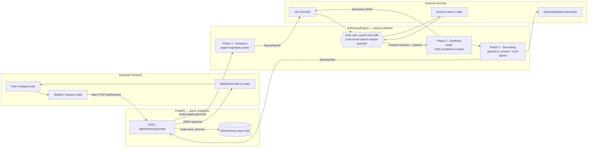
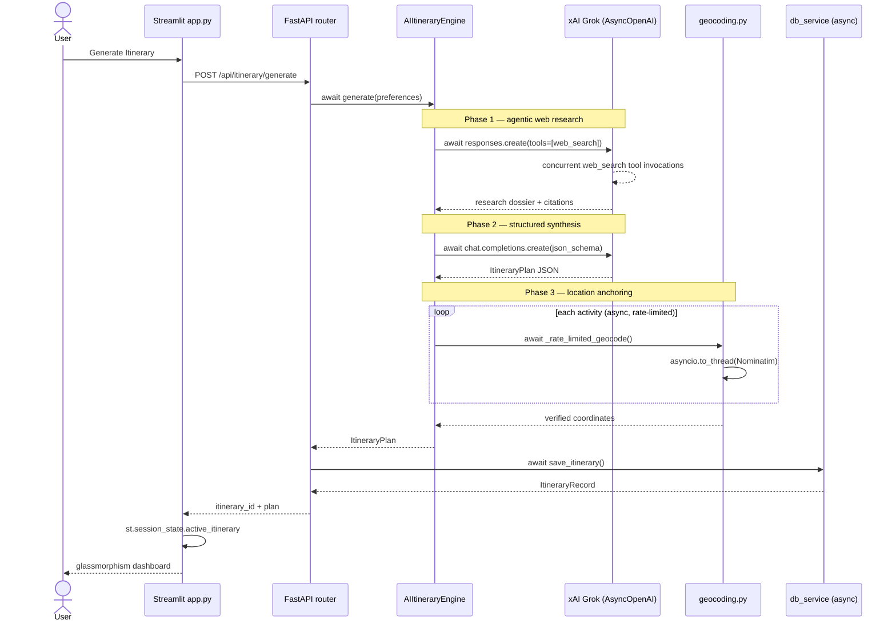

# Itinera — AI Itinerary Generator (MVP)

Hyper-personalized travel itineraries powered by **xAI Grok**, with an **async FastAPI backend** and **Streamlit frontend**.

## Features

- **Structured preferences**: destination, duration, travel party, pace, budget tier, and multi-select interests
- **Search-then-Synthesize pipeline**: Grok web search → structured JSON synthesis → map anchoring
- **AI-generated daily plans**: Morning → Lunch → Afternoon → Evening blocks with costs and coordinates
- **Progressive Foodie Tour**: lunch blocks paired with nearby dessert/coffee walking routes
- **Live Events & Entertainment**: concerts, sports, theater, and match days via real-time web search
- **Retry on bad JSON**: automatic retries when LLM output fails validation
- **SQLite persistence**: SQLAlchemy async layer (`database.py`), migratable to PostgreSQL
- **Structured Grok outputs**: native `json_schema` with Pydantic-backed validation
- **Geocoding fallbacks**: `geopy` + Nominatim with async rate-limit queue so maps never break
- **Saved trips**: reload historical itineraries from the sidebar without re-calling xAI
- **Route maps**: Folium polylines connect daily stops in timeline order
- **Share links**: public `GET /shared/itinerary/{uuid}` + `?trip=` view-only Streamlit mode
- **Offline export**: Markdown travel guides via `st.download_button`
- **Premium dark UI**: glassmorphism Streamlit theme with session-persisted active itinerary state

## Architecture

End-to-end flow from user click to rendered itinerary:



### Request lifecycle (sequence view)



## Asynchronous engine

Itinera is built as a **distributed-style async pipeline** on Python's **`asyncio` event loop** — no blocking calls on the FastAPI worker during I/O-bound work.

| Layer | Async mechanism | Role |
|-------|-----------------|------|
| **FastAPI** | `async def` route handlers | Non-blocking HTTP; each generate request runs as an asyncio task on Uvicorn's loop |
| **xAI client** | `AsyncOpenAI` + `await` | Non-blocking calls to Grok Responses API (research) and Chat Completions (synthesis) |
| **Web search** | Grok `web_search` tool loop | Agent issues **concurrent background search tasks** against live indices; Python awaits the aggregated response |
| **Geocoding** | `asyncio.to_thread()` | Blocking Nominatim lookups offloaded to a thread pool so the event loop stays free |
| **Rate-limit queue** | `asyncio.Lock` + `asyncio.sleep()` | Serializes geocode requests into a **FIFO async task queue** (Nominatim 1 req/s policy) |
| **Database** | SQLAlchemy 2.x `asyncio` + `aiosqlite` | Non-blocking CRUD for itinerary persistence and sidebar history |

Key entry points:

```python
# routers/itinerary.py — async HTTP boundary
async def generate_itinerary(body: ItineraryGenerateRequest) -> ItineraryGenerateResponse:
    plan = await engine.generate(body.preferences)      # asyncio pipeline
    record = await db_service.save_itinerary(...)       # async SQLAlchemy session
    return ItineraryGenerateResponse(...)

# services/ai_engine.py — Search-then-Synthesize
async def generate(self, preferences) -> ItineraryPlan:
    raw = await self._call_llm(preferences)             # Phase 1 + 2 (AsyncOpenAI)
    plan = await anchor_itinerary_locations(plan)       # Phase 3 (asyncio geocode queue)

# services/geocoding.py — thread-pool + lock queue
async def _rate_limited_geocode(query: str):
    async with _geocode_lock:                           # task serialization
        await asyncio.sleep(wait)                       # rate-limit spacing
        return await asyncio.to_thread(_nominatim_geocode_sync, query)
```

This design keeps the API responsive under concurrent users while Grok and Nominatim perform slow external I/O — the same pattern used in production **async task workers** and **distributed ingestion pipelines**, implemented here with native `asyncio` rather than a separate broker.

## Project structure

```
Itinera/
├── app.py                 # Streamlit frontend entrypoint
├── main.py                # FastAPI backend entrypoint
├── schemas.py             # Pydantic data models
├── config.py              # Environment-based settings
├── database.py            # SQLAlchemy async ORM (SQLite / Postgres)
├── requirements.txt
├── services/
│   ├── ai_engine.py       # Search-then-Synthesize engine (AsyncOpenAI)
│   ├── db_service.py      # Async itinerary CRUD
│   ├── geocoding.py       # asyncio geocode queue + Nominatim anchoring
│   └── export_service.py  # Markdown export
├── routers/
│   ├── itinerary.py       # REST API routes
│   └── shared.py          # Public share endpoints
└── frontend/
    ├── api_client.py      # HTTP client for backend
    ├── components.py      # Streamlit UI components
    ├── theme.py           # Premium dark-mode CSS theme
    └── sharing.py         # Share-link helpers
```

## Quick start

### 1. Install dependencies

```bash
cd Itinera
python -m venv .venv
source .venv/bin/activate   # Windows: .venv\Scripts\activate
pip install -r requirements.txt
```

### 2. Configure environment

```bash
cp .env.example .env
```

For local development without an API key, set `USE_MOCK_LLM=true` in `.env`.

To use xAI Grok, set your key and disable mock mode:

```env
XAI_API_KEY=xai-...
XAI_MODEL=grok-4.3
USE_MOCK_LLM=false
```

### 3. Start the backend

```bash
uvicorn main:app --reload --host 127.0.0.1 --port 8000
```

API docs: http://127.0.0.1:8000/docs

### 4. Start the frontend

In a second terminal:

```bash
streamlit run app.py
```

Open http://localhost:8501, configure your trip in the sidebar, and click **Generate Itinerary**.

## API

| Method | Endpoint | Description |
|--------|----------|-------------|
| `GET` | `/health` | Health check |
| `POST` | `/api/itinerary/generate` | Generate and store an itinerary |
| `GET` | `/api/itinerary/summaries` | List saved trip summaries (sidebar) |
| `GET` | `/api/itinerary/{id}` | Fetch itinerary by ID |
| `GET` | `/api/itinerary` | List all stored itineraries |
| `GET` | `/shared/itinerary/{id}` | Public view-only itinerary (share token) |

### Example request

```bash
curl -X POST http://127.0.0.1:8000/api/itinerary/generate \
  -H "Content-Type: application/json" \
  -d '{
    "preferences": {
      "destination": "Tokyo",
      "duration_days": 2,
      "travel_party": "Couple",
      "pace": "Moderate",
      "budget_tier": "Mid-range",
      "interests": ["Foodie", "Culture", "Live Events & Entertainment"]
    }
  }'
```

## Architecture notes

- **Business logic** lives in `services/ai_engine.py` (Search-then-Synthesize, JSON parsing, validation, retries).
- **Async I/O** is coordinated via `asyncio` across FastAPI, `AsyncOpenAI`, and SQLAlchemy; geocoding uses `asyncio.to_thread` + `asyncio.Lock`.
- **Presentation** lives in `frontend/components.py`, `frontend/theme.py`, and `app.py`.
- **Data layer** is `database.py` + `services/db_service.py`. Set `DATABASE_URL=postgresql+asyncpg://...` for production.
- **Screenshots and examples** are available in the [`screenshots/`](screenshots/) folder.

## GitHub topics

Recommended repository topics:

- `travel`
- `itinerary`
- `grok`
- `fastapi`
- `streamlit`
- `ai-agent`

## License

MIT
